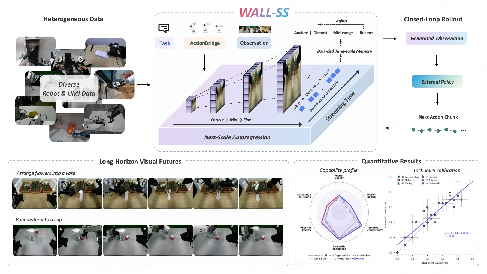
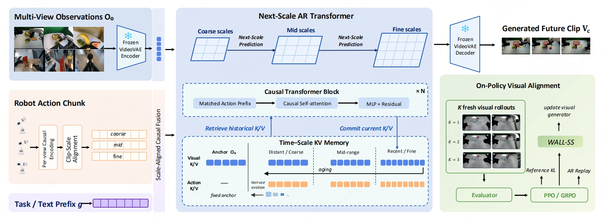
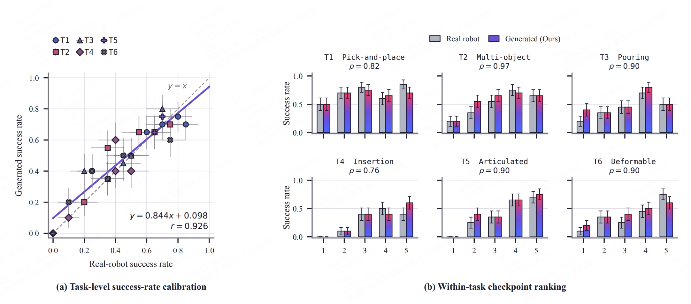

<div align="center">

<h1><strong>WALL-SS</strong></h1>

<h3>Scaling Long-horizon World Models via Next-Scale Autoregression</h3>

</div>

<div id="top" align="center">

[](https://arxiv.org/pdf/2608.26239)
[](https://wall-ss.ws-robotics.workers.dev/)
[](https://github.com/X-Square-Robot/wall-ss)
[](https://huggingface.co/papers/2608.26239)
[](https://modelscope.cn/papers/2608.26239)
[](#license)

</div>

**WALL-SS** is a generative world model for **action-controllable, long-horizon robotic simulation**. Instead of predicting a single future clip, it models embodied trajectories as a causal sequence of interleaved observations and actions, and generates each visual future through coarse-to-fine **next-scale autoregression**. This formulation keeps four capabilities in one process:

- **Unified** — vision, language, and action share one causal architecture
- **Variable-length** — no fixed prediction horizon
- **Streaming** — reusable causal states support continuous interaction
- **Reward-optimizable** — token-level probabilities give a native RL interface

<div align="center">
    
</div>

**Key ingredients:**

- **Action-conditioned next-scale prediction.** Scale-aligned action tokens guide coarse-to-fine generation, so the model follows prescribed controls — including suboptimal and failed behaviors, not only likely successes.
- **Scale-compressed long-horizon memory.** Recent history stays fine; distant observations and their action histories are progressively compressed under a bounded budget. Scale-wise dream forcing trains the model on self-generated context, so memory cost does not grow with rollout length.
- **On-policy alignment of visual dynamics.** Next-scale generation is treated as a stochastic policy and optimized with action-following and long-horizon consistency rewards, while remaining close to the pretrained visual distribution.
- **Next-scale autoregressive backbone.** Initialized from [InfinityStar](https://arxiv.org/abs/2511.04675), the model generates each future observation coarse-to-fine and propagates state over streaming time with bounded time–scale memory.

<div align="center">
    
</div>

Overall framework of WALL-SS.

**Results.**

<div align="center">
    
</div>

**Closed-loop calibration and within-task checkpoint ranking.** Left: task-level success-rate calibration between matched real-robot and generated rollouts (each marker is one task–checkpoint pair; dashed diagonal = perfect agreement, solid line = least-squares fit). Right: within-task ranking across five policy checkpoints (bars: real-robot vs. generated success rates with per-cell binomial standard errors; ρ: per-task Spearman rank correlations).

Over 600 matched sim–real rollout pairs, generated and real success rates agree with MAE **0.062** (r = 0.93); within-task checkpoint ranking has pairwise accuracy **0.89** and mean Spearman **ρ̄ = 0.88**; episode-level balanced accuracy is **0.88**.

**Embodied video generation.** On a WorldArena-style benchmark (200 ID + 100 OOD tasks):

| Model | Interaction ↑ | Instruction Following ↑ | Trajectory Acc. ↑ | Action Following ↑ |
|---|---|---|---|---|
| InfinityStar | 0.484 | 0.406 | 0.251 | – |
| Wan2.2-14B | 0.476 | 0.394 | 0.159 | – |
| CogVideoX-5B | 0.400 | 0.380 | 0.177 | – |
| Cosmos3-Nano | 0.516 | 0.410 | 0.202 | 0.044 |
| **WALL-SS** | **0.546** | **0.471** | **0.539** | **0.290** |

The same external robot policy, run in WALL-SS and on the physical robot, produces **calibrated task outcomes** and **consistent checkpoint rankings** — evidence that the learned dynamics are useful for downstream policy evaluation. A co-trained action expert reads the committed causal state and controls a physical bimanual platform, reaching average Task Progress **69.1** vs. π0.5 (49.6), DreamZero (44.1), and LingBot-VA (34.0).

See the paper for method details and the large-scale real-world evaluation: [WALL-SS: Scaling Long-horizon World Models via Next-Scale Autoregression](wall-ss-paper.pdf).


## Updates

- **2026-08-26** Paper released.


## TODO

- [x] Release the paper (2026-08-26).
- [ ] Release the training and inference code.


## Join Our Community

Scan the QR code on WeChat to join the discussion group, where you can engage in in-depth exchanges with community developers and the official team.

<div align="center">
    
</div>


## Citation

If you find our work helpful, please cite:

```bibtex
@misc{zhang2026wallssscalinglonghorizonworld,
      title={WALL-SS: Scaling Long-horizon World Models via Next-Scale Autoregression}, 
      author={Maeve Zhang and Rain Sun and Xiang Wang and Cyril Zhang and Shalfun Li and Meng Cao and Howard Lu and Ethan Chen and Harry Jhou and KZ Zheng and Lights Shi and Regis Cheng and Lorenzin and Robert Wang and Victor Yao and Gody Li and Elise Mon and Yohann Tang and Ryan Yu and PS Zhang and Vincent Chen and Hang Su and Roy Gan and Hao Wang and Qian Wang},
      year={2026},
      eprint={2608.26239},
      archivePrefix={arXiv},
      primaryClass={cs.RO},
      url={https://arxiv.org/abs/2608.26239}, 
}
```


## License

Code will be released under the MIT License. This repository currently contains only the project page.
